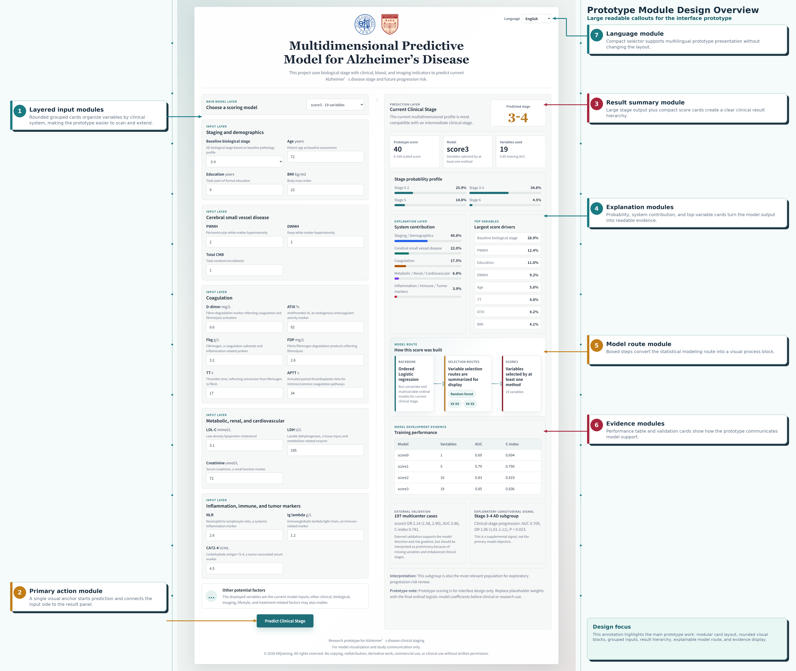

# Multidimensional Predictive Model for Alzheimer's Disease

一个用于展示阿尔茨海默病多维预测模型的 React/Vite 前端原型。项目结合基线生物学分期、临床信息、血液指标和影像相关变量，用于预测患者当前临床分期，并展示模型解释、变量贡献和验证结果。

Live demo:

```text
https://KKjiaming.github.io/Med_AD/
```

## 项目背景

本项目关注阿尔茨海默病患者中一个常见但重要的问题：生物学分期与临床表现并不完全一致。即使两个患者具有相近的 Aβ/Tau 病理水平，他们的认知症状、临床分期和后续恶化速度仍可能不同。

因此，该原型用于展示一个解释型评分模型：基线生物学分期与多维度临床、血液、影像相关指标共同预测患者当前临床分期，并进一步提示未来认知下降或临床分期加重风险。

## 界面说明

下图为项目预测后的真实界面截图。左侧是模型输入区，右侧是预测结果、解释层、建模路线和验证结果。



图中已经概括了模型的主要信息：

- **模型设计**：采用解释型建模路线，而不是黑箱预测；流程为描述性分析、有序 Logistic 回归、共线性检查，再结合随机森林和两条匿名变量筛选路径形成评分。
- **评分模型**：支持 `score0-score3` 四套递进式模型；截图中展示的是 `score3`，纳入任一方法入选的 19 个变量。
- **输入变量**：变量按五个系统录入，包括分期/人口学、脑小血管病、凝血系统、代谢/肾功能/心血管、炎症/免疫/肿瘤标志物。
- **结果解释**：右侧同时展示预测分期、0-100 原型评分、分期概率分布、系统贡献、主要驱动变量和模型开发证据。
- **示例结果**：截图中的输入更接近 `3-4` 期，主要贡献来自分期/人口学、脑小血管病和凝血系统。
- **验证信息**：界面底部简要展示训练集性能、197 例外部验证和中期 AD 患者的探索性纵向信号。

## 技术栈

```text
React 18
Vite 5
JavaScript
CSS
GitHub Pages
GitHub Actions
```

## 本地运行

安装依赖：

```bash
npm install
```

启动开发服务器：

```bash
npm run dev
```

本地构建：

```bash
npm run build
```

预览生产构建：

```bash
npm run preview
```

## 部署

项目通过 GitHub Actions 自动部署到 GitHub Pages。推送到 `main` 分支后，workflow 会自动执行：

```text
npm ci
npm run build
upload dist
deploy to GitHub Pages
```

GitHub Pages 设置应为：

```text
Settings -> Pages -> Build and deployment -> Source -> GitHub Actions
```

## 版权与使用限制

Copyright © 2026 KKjiaming. All rights reserved.

本仓库、网页界面、源代码、文档、截图、模型展示方式、文字说明和相关材料仅供查看与研究交流参考。除非获得作者事先书面许可，否则不得复制、转载、再发布、镜像、改编、翻译、商用、用于课程/产品/论文展示，或将本项目及其任何实质性部分声称为自己的工作。

本项目没有授予开源许可证。代码公开在 GitHub 上不代表允许他人复用、分发或创建衍生作品；GitHub 平台允许查看和 fork 的技术权限不等同于版权授权。

如需使用本项目的代码、界面、截图、模型展示或文档内容，请先联系作者并取得书面授权。

## 目录结构

```text
src/
├── App.jsx
├── main.jsx
├── styles.css
├── components/
│   ├── Header.jsx
│   ├── PatientForm.jsx
│   ├── RiskResult.jsx
│   └── Footer.jsx
└── lib/
    ├── constants.js
    ├── i18n.js
    ├── interpretation.js
    ├── riskModel.js
    └── validation.js
```

## 注意事项

当前项目是研究展示和界面原型。评分权重和预测结果用于模型可视化与汇报演示，不应直接作为临床诊断、治疗决策或正式研究结论使用。正式使用前应替换为最终统计模型系数，并完成充分的外部验证。
